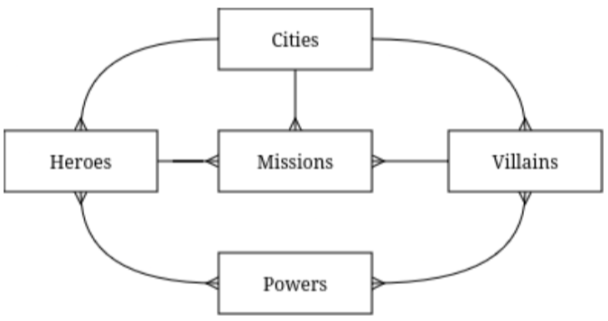

# Database Outline
- **Cities**: Major cities that heroes reside and operate in.
    - city_id: int, auto_increment, unique, not NULL, PK
    - city_name: varchar(50)
    - country: varchar(50)
    - Relationships:
        - 1:M with the Heroes table
        - 1:M with the Villains table
        - 1:M with the Missions table

- **Heroes**: Records about the data of heroes.
    - hero_id: int, auto_increment, unique, not NULL, PK
    - city_id: int, not NULL, FK (Cities)
    - current_mission: int, FK (Missions)
    - pseudonym: varchar(50), not NULL
    - first_name: varchar(50)
    - last_name: varchar(50)
    - Relationships:
        - 1:M with the Missions table
        - M:1 with the Cities table
        - M:M with the Powers table

- **Missions**: Records of current and past missions handled by heroes.
    - mission_id: int, auto_increment, unique, not NULL, PK
    - mission_codename: varchar(50), not NULL
    - city: int, not NULL, FK (Cities)
    - hero: int, not NULL, FK (Heroes)
    - villain: int, not NULL, FK (Villains)
    - description: text(1000), not NULL
    - Relationships:
        - M:1 relationship with the Heroes table
        - M:1 relationship with the Villains table
        - M:1 relationship with the Cities table

- **Powers**: Record of all known superpowers to SHIELD.
    - power_id: int, auto_increment, unique, not NULL, PK
    - name: varchar(50), not NULL
    - description: text(1000)
    - Relationships:
        - M:M with the Heroes table
        - M:M with the Villains table

- **Villains**: Records about the data of villains.
    - villain_id: int, auto_increment, unique, not NULL, PK
    - pseudonym: varchar(50), not NULL
    - first_name: varchar(50)
    - last_name: varchar(50)
    - last_known_loc: int, FK (Cities)
    - Relationships:
        - 1:M with the Missions table
        - M:1 with Cities table
        - M:M for the Powers table

- **HeroPowers**: Intersection table for the power of heroes.
    - hero_id: int, FK (Heroes)
    - power_id: int, FK (Powers)
    - Relationships:
        - M:1 with Heroes table
        - M:1 with Powers table

- **VillanPowers**: Intersection table for the powers of villains.
    - villain_id: int, FK (Villains)
    - power_id: int, FK (Powers)
    - Relationships:
        - M:1 with Villains table
        - M:1 with Powers table

Props to Kippen Lee for the ER Diagram!

